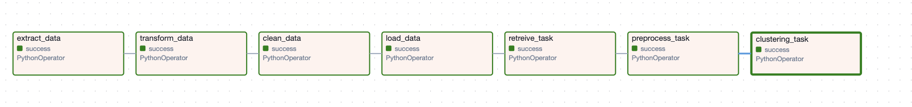
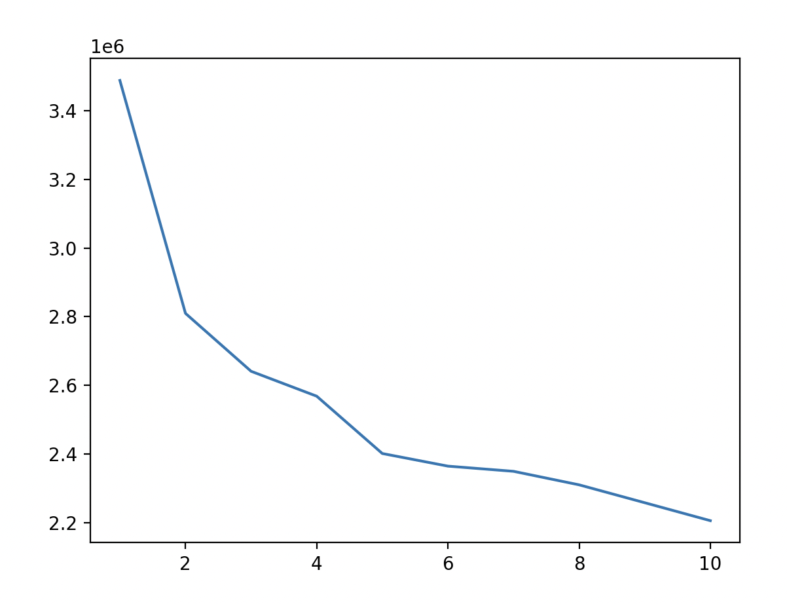
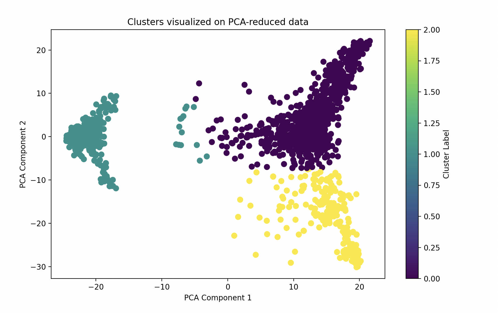
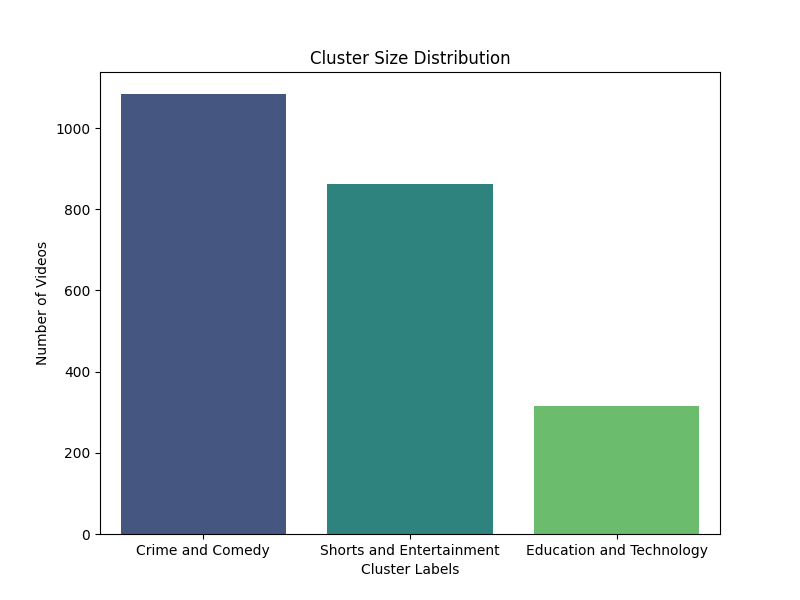
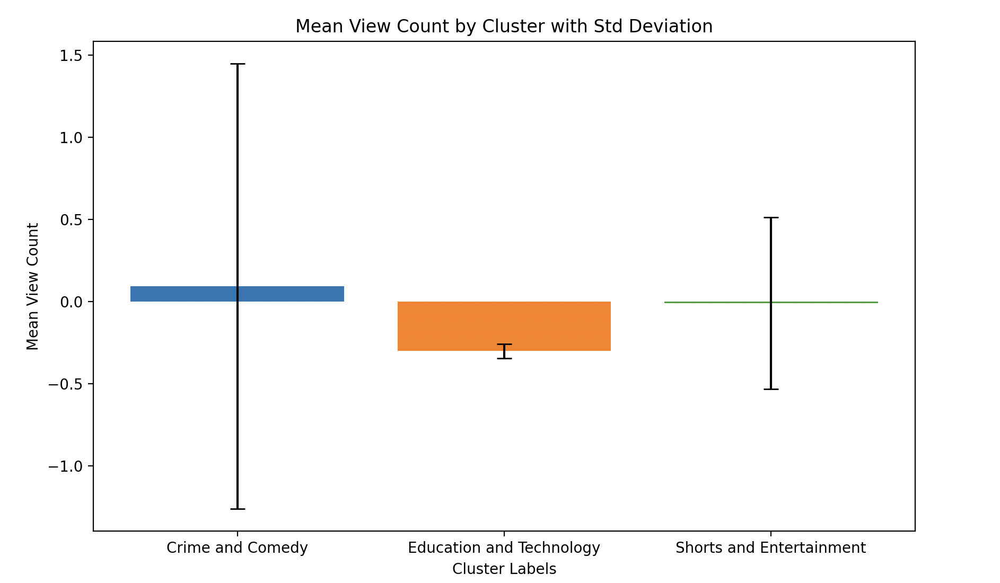

## Table of Contents
- [Project Overview](#project-overview)
- [Setup Instructions](#setup-instructions)
- [Usage Instructions](#usage-instructions)
- [Embedding Comparison: Word2Vec vs BERT](#embedding-comparison-word2vec-vs-bert)
- [Visualizations](#visualizations)
- [Post-Cluster Classification](#post-cluster-classification)
- [Future Scope](#future-scope)


## Project Overview

With the sheer volume of content, finding something that matches not only my interests but also my current mood or time of day can be a challenge.

That’s where this project comes in.

Designed to **analyze my own YouTube viewing habits**, this project leverages a powerful **ETL pipeline** and **machine learning** techniques to recommend videos tailored to my personal viewing patterns. By examining my **watch history** and **YouTube metadata**, the system provides insights into how my content consumption shifts throughout the day—whether I gravitate toward educational content in the morning or prefer lighter entertainment in the evening.

I used **BERT embeddings** to analyze video titles and tags, creating **clusters** of similar videos that match my viewing trends. Through **time-of-day analysis**, the project makes recommendations that align with my daily rhythm, helping me make the most of the time I spend on YouTube.

Though currently focused on providing recommendations based on these clusters, the project is designed to grow. Future updates could integrate classification models to categorize new videos automatically, ensuring my recommendations stay personalized and relevant over time.

<div style="text-align: center;">
    
</div>


## Setup Instructions

### 1. **Clone the repository:**
First, clone the project repository to your local machine.

```bash
git clone https://github.com/yourusername/yourproject.git
```

### 2. **Navigate to the project directory:**
Go into the directory where the project files are located:

```bash
cd ETLproject
```

### 3. **Set up the virtual environment and install dependencies:**

```bash
python3 -m venv venv
source venv/bin/activate
pip install -r requirements.txt
```

### 4. **Set up YouTube API Key:**

The project uses the YouTube Data API to fetch metadata for videos. You’ll need to create an API key by following these steps:

1. Go to the [Google Developer Console](https://console.cloud.google.com/).
2. Create a new project or select an existing one.
3. Navigate to the "API & Services" section and enable the **YouTube Data API v3**.
4. Create a new API key.
5. Store the API key in a `.env` file or directly in your code (though `.env` is preferred).

Here’s an example of how to structure the `.env` file:

```bash
YOUTUBE_API_KEY=your_api_key_here
```
### Prerequisites: Downloading YouTube Watch History

To use this project with your own YouTube data, you need to download your YouTube watch history from Google Takeout:

1. Go to [Google Takeout](https://takeout.google.com/).
2. Download your YouTube watch history as a `.json` file (ensure you select only the 'YouTube' data).
3. Place the downloaded `watch-history.json` file in the `data/` folder of this project:
   ```bash
   mv /path/to/your/downloaded/watch-history.json data/watch-history.json
   ```

### 5. **Set up Airflow:**

You’ll need to install and configure Airflow for running the ETL pipeline.

- [Airflow Installation Guide](https://airflow.apache.org/docs/apache-airflow/stable/installation/index.html).

Once Airflow is installed, you can set up your Airflow directory structure and copy your DAGs and scripts to the appropriate location. Make sure to configure Airflow to detect your DAG by adding it to the `dags_folder`.

### 6. **Amazon S3 Setup:**

This project uses Amazon S3 to store the output file.
- Set up an S3 bucket.
- Add your AWS credentials in the `~/.aws/credentials` file, or configure them using the AWS CLI.
- The DAG will automatically upload the data to your specified S3 bucket in the pipeline.

### 7. **Running the Project:**

Once everything is set up:
1. Start the Airflow webserver:
    ```bash
    airflow webserver
    ```
2. Start the Airflow scheduler:
    ```bash
    airflow scheduler
    ```
3. Trigger the DAG for the ETL pipeline manually from the Airflow UI, or let it run on a schedule (based on your DAG configuration).

4. Check the Airflow logs for each task to ensure the pipeline runs successfully.


## Usage Instructions
### 1. Running the ETL Pipeline
The entire ETL pipeline, including clustering and recommendations, can be orchestrated through Airflow. Follow these steps to run the ETL pipeline:

- Ensure that Airflow is properly set up on your local machine or environment and then start the webserver and scheduler.

Go to the Airflow UI (usually accessible at http://localhost:8080) and trigger the DAG named youtube_etl_pipeline

### 2. Running Unit Tests

This project includes unit tests to ensure that the ETL process and individual tasks work correctly. These tests are located in the `tests/` directory.

#### To run the unit tests:

1. Install `pytest` if you haven't already:
   ```bash
   pip install pytest
Navigate to the root of the project directory and run the tests:
```bash
pytest tests/
```

## Embedding Comparison: Word2Vec vs BERT

Initially, I experimented with the **Word2Vec** model for embedding the video titles and tags. However, the clustering results were not ideal. With Word2Vec embeddings, I only obtained two clusters, and upon further investigation, the content within each cluster was highly varied. For example, videos from different genres (e.g., educational and entertainment) were grouped together, which led to less meaningful insights.

### Why BERT Was Chosen
To improve clustering results, I switched to **BERT** embeddings, which provided a better representation of the video content. BERT embeddings, being more context-aware, helped in grouping videos more accurately based on their content. As a result, the clusters became more meaningful, with videos in each cluster sharing similar themes (e.g., Education and Technology, Shorts and Entertainment etc).

The comparison between **Word2Vec** and **BERT** embeddings can be summarized as:

| Model      | Number of Clusters | Description of Clusters                   |
|------------|--------------------|-------------------------------------------|
| Word2Vec   | 2                  | Varied content, less meaningful grouping. |
| BERT       | 3                  | Distinct clusters with related content.   |

Ultimately, **BERT** embeddings led to better results, so I used BERT for the final implementation.

## Visualizations

To understand and validate the clustering results, several visualizations were created during the analysis process. These visualizations helped in determining the optimal number of clusters, interpreting the clusters, and uncovering patterns in viewing habits.

### Determining the Optimal Number of Clusters

#### Elbow Method

To determine the optimal number of clusters (k), the Elbow Method was used. This method involves plotting the total within-cluster sum of squares (inertia) against the number of clusters and identifying the point where adding another cluster doesn't significantly reduce inertia, indicating an optimal k.

<div style="text-align: center;">  </div>

As shown in the plot, there is a significant drop in inertia around k=3 to k=5. Additionally, silhouette scores were calculated for k=2, k=3, and k=5:

- **k=2**: Lower score
- **k=3**: Higher score
- **k=5**: Highest score

Despite k=5 having the highest silhouette score, the difference between k=3 and k=5 was marginal. For simplicity and interpretability, k=3 was chosen as the optimal number of clusters.

### Cluster Visualization

#### Clustering with k=3

After selecting k=3, the clusters were visualized using Principal Component Analysis (PCA) to reduce the data to two dimensions. Each point represents a video, colored by its assigned cluster.

<div style="text-align: center;">  </div>

The three clusters represent distinct content groups based on the features extracted from the video data.

#### Clustering with k=5

For comparison, clustering was also performed with k=5, resulting in the following visualization:

<div style="text-align: center;">  </div>

While k=5 provides a finer grouping of content types, the increased complexity did not significantly improve clustering quality. Therefore, k=3 was retained for its balance between simplicity and interpretability.

### Cluster Interpretation and Analysis

#### Cluster Size Distribution

Understanding the distribution of videos across the three clusters helps identify which content types dominate your viewing habits.

<div style="text-align: center;">  </div>

The clusters represent the following content categories:

- **Cluster 0**: Crime and Comedy  
  A mix of entertainment and true crime content.

- **Cluster 1**: Shorts and Entertainment  
  Quick, bite-sized entertainment content, typically found in YouTube Shorts.

- **Cluster 2**: Education and Technology  
  Informative and educational videos focused on tech-related topics.

#### Mean View Count by Cluster

The graph below shows the mean view count for each cluster, along with the standard deviation. This visualization provides insights into how view counts vary across different clusters and can indicate the popularity of content types.

<div style="text-align: center;">  </div>

- **Crime and Comedy**:  
  - Mean View Count: Moderate  
  - Standard Deviation: High  
  - Interpretation: A wide range of view counts, from niche to highly popular videos, indicating diverse audience sizes within this cluster.

- **Education and Technology**:  
  - Mean View Count: Slightly lower  
  - Standard Deviation: Low  
  - Interpretation: Consistent view counts across videos, suggesting a dedicated but smaller audience.

- **Shorts and Entertainment**:  
  - Mean View Count: Higher  
  - Standard Deviation: Moderate  
  - Interpretation: Balanced engagement, with videos generally receiving similar levels of views.

### Key Takeaways:

- **Crime and Comedy** exhibits the greatest variation in video popularity, making it an interesting cluster for deeper insights into what factors contribute to a video's success.
- **Education and Technology** has consistent view counts, which might suggest content that appeals to a specific, niche audience.
- **Shorts and Entertainment** shows higher average view counts with moderate variation, indicating widespread appeal and consistent engagement.

### Dominant Cluster by Time of Day

Analyzing which clusters are dominant at different times of the day reveals patterns in my viewing habits.

| Time of Day | Dominant Cluster         |
|-------------|--------------------------|
| Morning     | Crime and Comedy          |
| Afternoon   | Shorts and Entertainment  |
| Evening     | Education and Technology  |
| Night       | Crime and Comedy          |

**Interpretation:**

- **Morning and Night**: A preference for Crime and Comedy content suggests that you start and end your day with entertainment and engaging narratives.
- **Afternoon**: An inclination toward Shorts and Entertainment indicates a preference for quick, easily consumable content during midday.
- **Evening**: A shift to Education and Technology suggests that you engage with more informative and intellectually stimulating content later in the day.

This time-of-day analysis can help tailor recommendations to align with your daily routines and moods, enhancing the personalization of content suggestions.


### Post-Cluster Classification

After generating clusters for the video data, this project includes an optional **classification task** that predicts which cluster a new video should belong to based on its features such as title, tags, and engagement metrics. This classification model can streamline the recommendation process for new videos without needing to rerun the clustering algorithm every time new data is added.

#### Why It Matters:
As the dataset grows, continuously re-running the entire clustering process for every new video can become computationally expensive. Instead, by training a classification model on the clusters, we can quickly and efficiently assign new videos to clusters for recommendations.

#### Classification Models Used:
Several classification models have been implemented to predict the cluster labels:
- **Logistic Regression**
- **Random Forest**
- **Support Vector Machine (SVM)**

#### Assumptions:
- **Content Similarity**: The classification models assume that the user will continue consuming content that is similar to the clusters already identified. For example, if a user's watching history mostly involves content from the "Entertainment" or "Educational" clusters, the classification model will expect new videos to follow similar patterns.
  
- **Handling Outliers**: There is a possibility that new videos may not fit into any of the existing clusters. In this case, the recommendation model might incorrectly classify the video, leading to suboptimal recommendations.

#### Enhancements for Handling Outliers:
1. **Outlier Detection**: We recommend adding an outlier detection step, where the distance between the new video’s feature vector and the closest cluster’s centroid is calculated. If the distance exceeds a certain threshold, the video can be flagged as an outlier and treated differently (e.g., assigned to a miscellaneous cluster).
   
2. **Soft Clustering**: Soft clustering techniques, such as **Gaussian Mixture Models (GMM)**, could be used in the future to give new videos partial membership to multiple clusters. This would allow the system to handle content that doesn't exactly fit into one cluster but shares similarities with multiple clusters.

### Future Scope:
- **Model Retraining**: As user content preferences evolve, some new videos may not fit into the existing clusters. Retraining the clustering model periodically could improve the accuracy of future recommendations.
  
- **CI/CD Integration**: Set up continuous integration (CI) and continuous deployment (CD) pipelines to automate testing, deployment, and updates to the project.

- **Deploying on Cloud**: Consider deploying the project to a cloud environment (e.g., AWS, GCP, or Heroku) to make the recommendations available as an accessible web service.


